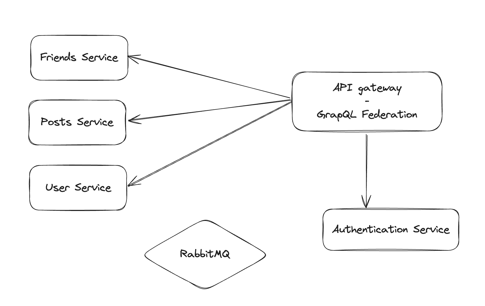

# Social network microservices

## Scripts
- Start development environment: `make start-env`
- Start development environment with logs: `make start-env-debug`
- Stop development environment: `make stop-env`

## Local development
- Setup env config
  - Copy `.env.sample` into `.env`
  - cd `docker`
  - run `ln -s ../.env ./.env`
- Start development environment: `make start-env`
- Stop development environment: `make stop-env`
